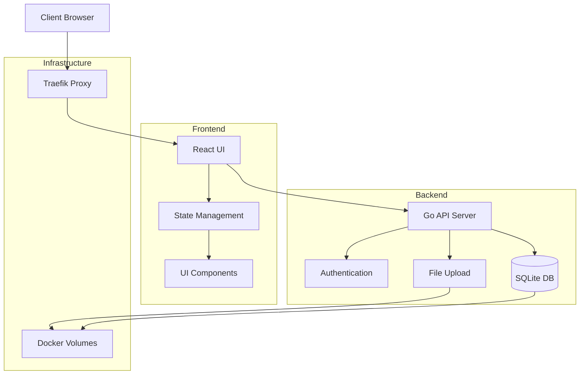
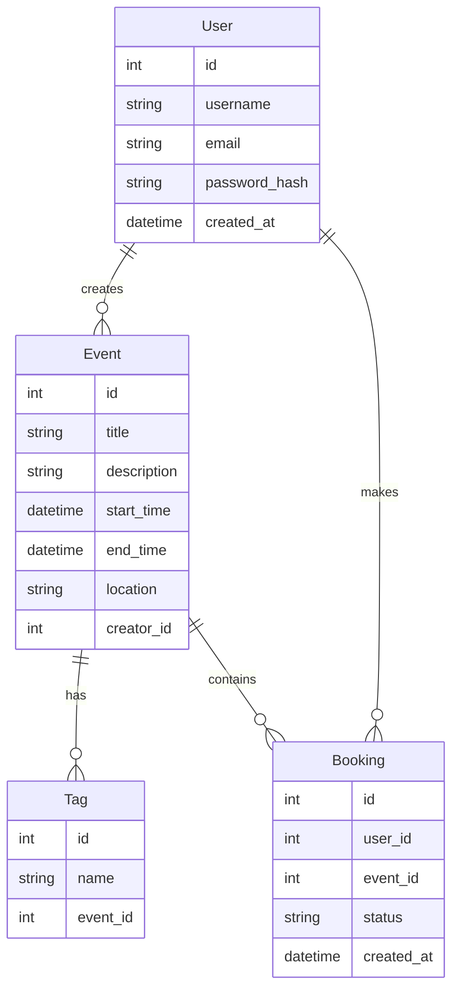

# Online Task Management System

A modern, full-stack application for managing online tasks, events, and bookings with user authentication.

## 🏗️ Architecture Overview

### Tech Stack

#### Backend (Go)
- Go 1.21+
- SQLite Database
- JWT Authentication
- RESTful API
- File Upload Support

#### Frontend (React/TypeScript)
- React 18
- TypeScript 5
- Vite
- Modern UI Components
- State Management with Redux/Context
- Responsive Design

#### Infrastructure
- Docker & Docker Compose
- Traefik (Reverse Proxy)
- HTTPS Support
- Volume Persistence

### System Architecture Diagram



### Entity Relationship Diagram



## 🚀 API Endpoints

### Authentication
- POST `/api/auth/register` - Register new user
- POST `/api/auth/login` - User login
- POST `/api/auth/refresh` - Refresh JWT token

### Events
- GET `/api/events` - List all events
- POST `/api/events` - Create new event
- GET `/api/events/{id}` - Get event details
- PUT `/api/events/{id}` - Update event
- DELETE `/api/events/{id}` - Delete event

### Bookings
- GET `/api/bookings` - List user's bookings
- POST `/api/bookings` - Create new booking
- PUT `/api/bookings/{id}` - Update booking status
- DELETE `/api/bookings/{id}` - Cancel booking

### Tags
- GET `/api/tags` - List all tags
- POST `/api/tags` - Create new tag
- DELETE `/api/tags/{id}` - Delete tag

### File Upload
- POST `/api/upload` - Upload file
- GET `/api/uploads/{filename}` - Get uploaded file

## 🛠️ Setup Instructions

1. **Prerequisites**
   - Docker and Docker Compose
   - Make (optional, for using Makefile commands)
   - Node.js 18+ (for local frontend development)
   - Go 1.21+ (for local backend development)

2. **Environment Setup**
   ```bash
   # Clone the repository
   git clone <repository-url>
   cd online-task

   # Create necessary environment files
   cp .env.example .env
   ```

3. **Running with Docker**
   ```bash
   # Create the traefik network
   docker network create traefik-public

   # Start all services
   docker-compose up -d
   ```

4. **Local Development**
   ```bash
   # Backend
   cd backend
   go mod download
   go run cmd/main.go

   # Frontend
   cd frontend
   npm install
   npm run dev
   ```

## 📁 Project Structure

```
.
├── backend/
│   ├── cmd/            # Application entrypoints
│   ├── internal/       # Private application code
│   │   ├── auth/      # Authentication logic
│   │   ├── booking/   # Booking management
│   │   ├── event/     # Event management
│   │   ├── models/    # Data models
│   │   ├── tag/       # Tag management
│   │   └── upload/    # File upload handling
│   ├── pkg/           # Public libraries
│   └── data/          # SQLite database
├── frontend/
│   ├── src/
│   │   ├── components/# React components
│   │   ├── pages/     # Page components
│   │   ├── services/  # API services
│   │   ├── store/     # State management
│   │   └── types/     # TypeScript types
│   └── public/        # Static assets
└── docker-compose.yml # Docker composition
```

## 🔐 Security Features

- JWT-based authentication
- Secure password hashing
- HTTPS support via Traefik
- Environment variable configuration
- File upload restrictions

## 🤝 Contributing

1. Fork the repository
2. Create your feature branch
3. Commit your changes
4. Push to the branch
5. Create a Pull Request

## 📄 License

This project is licensed under the MIT License - see the LICENSE file for details. 